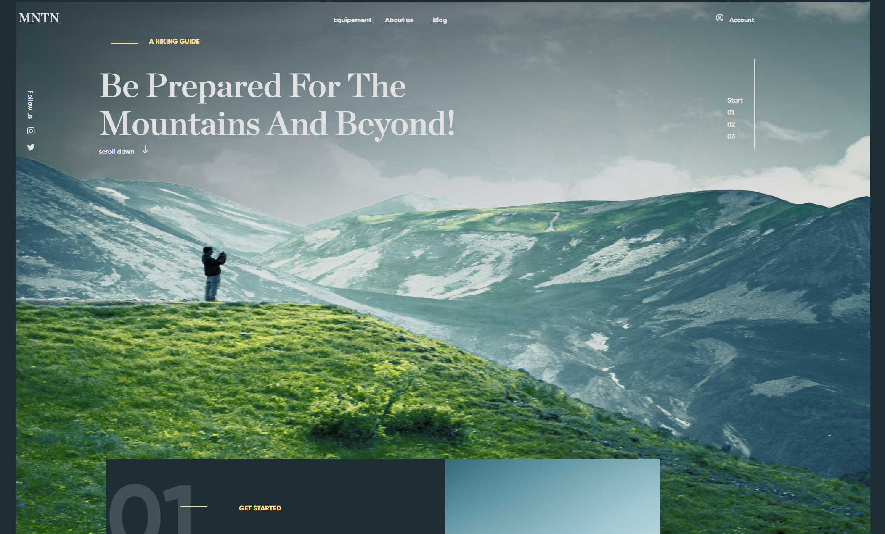

<h1 align="center">🏔️ Welcome to Projet MNTN 👋</h1>

  

---

## 📄 Description

🇫🇷 Ce projet représente une **page d'accueil** pour un site dédié à une **expérience de randonnée en montagne**.  
L’objectif était de travailler la structure visuelle d’un site avec **HTML et CSS uniquement**.

🇬🇧 This project showcases a **homepage** for a website about a **mountain hiking experience**.  
The goal was to build a visually structured site using only **HTML and CSS**.

---

  

## 🚀 Démo en ligne | Live Demo

🔗 [Voir la démo / View Live Demo](https://schatel-dev.github.io/Home-Page-MNTN/)

---

## 🧑‍💻 Technologies utilisées | Technologies Used

- ✅ HTML5
- 🎨 CSS3

Aucun JavaScript n’a été utilisé dans ce projet.  
No JavaScript was used in this project.

---

## 👤 Auteur | Author

**Sebastien C.**  
🎓 Promo 2025  
🔗 GitHub : [@schatel-dev](https://github.com/schatel-dev)

---

## 🌟 Support

🇫🇷 Si ce projet vous a aidé, pensez à lui laisser une **étoile ⭐**.  
🇬🇧 If this project helped you, feel free to give it a **⭐**.

---
